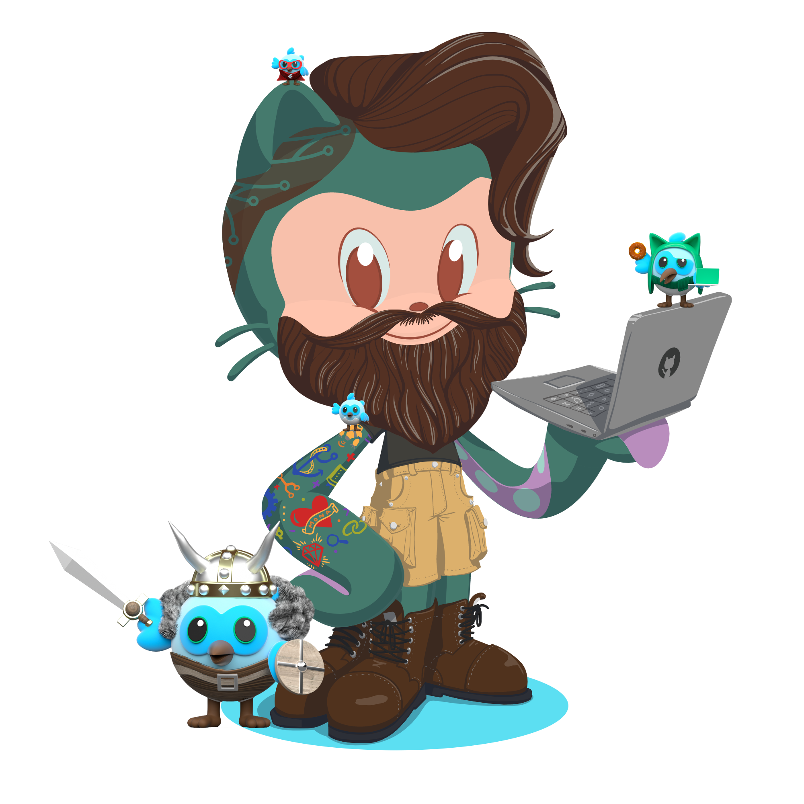

<h2>I'm Emanuel Braz, Flutter enthusiast and passionate about technological innovations </h2>
  
  
  

### Social Medias:

  

### Mobile Development  

 
### Web Development  

 
 

|GITHUB STATS|LANGUAGES|
|:---:|:---:|
||
